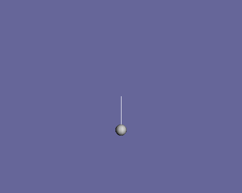

Design energy shaping swing-up controller
=========================================
If the input torque is limited, the linear feedback controller may be unable to
bring the pendulum to the upright configuration from an arbitrary initial
condition. Let's use trep to help create a swing-up controller based on the
energy of the system.

Create pendulum system
----------------------
The code used to create the pendulum system is identical to the last section,
except a new parameter ``uMax`` (highlighted below) has been added that sets the
maximum absolute value of the input.

.. literalinclude:: ./code_snippets/energyShapingSwingupController.py
    :start-after: # Import necessary python modules
    :end-before: # Design linear feedback controller
    :emphasize-lines: 20

Design energy shaping swing-up controller
-----------------------------------------
It can be easily shown that a control law to stabilize a one-link pendulum to
a reference energy is

.. math:: u = -K\dot{\theta}(E - \bar{E})

where :math:`E` is the current energy of the system, :math:`\bar{E}` is the
reference energy, and :math:`K` is any positive number. Therefore, the only
thing that must be done to implement the energy contoller is calculate the
reference energy and pick a positive gain value.

.. literalinclude:: ./code_snippets/energyShapingSwingupController.py
    :start-after: KStabilize = KVec[0]
    :end-before: # Simulate the system forward
    :emphasize-lines: 4

This is done by setting the system to the desired state and using the
:mod:`trep.System.total_energy` method to get the desired energy level, which is
called ``eBar``. The gain is set to one using ``KEnergy = 1``. Afterwards, the
system must be reset to its initial condition.

Simulate the system forward
---------------------------
The system is simulated forward in the exact same way as in the last section.

.. literalinclude:: ./code_snippets/energyShapingSwingupController.py
    :start-after: # Simulate the system forward
    :end-before: # Visualize the system in action

This time ``u`` is set to the energy shaping controller. Since the energy
shaping controller depends on the angular velocity it needs a "kick" if the
angular velocity is zero to get it going.

In addition the constraint on the input is included.

Visualize the system in action
------------------------------
The visualization is created in the exact way it was created in the previous
sections.

.. literalinclude:: ./code_snippets/energyShapingSwingupController.py
    :start-after: # Visualize the system in action

Let's also plot the state and input verse time.

.. image:: energyShapingSwingupControllerPlot.png

In the animation you can see that the pendulum swings-up and approaches the
upright configuration. It does not quite get there because the damping term is
not accounted for in the controller. However, it should be close enough that the
linear controller designed in the last section can take over and stabilize to
the upright configuration. Also, from the plot you can see that the input is
limited from -5 to +5.

Complete code
-------------
Below is the entire script used in this section of the tutorial.

.. literalinclude:: ./code_snippets/energyShapingSwingupController.py
    :linenos:

