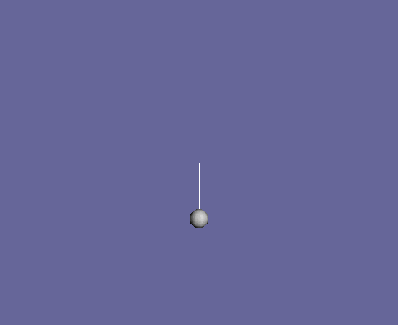
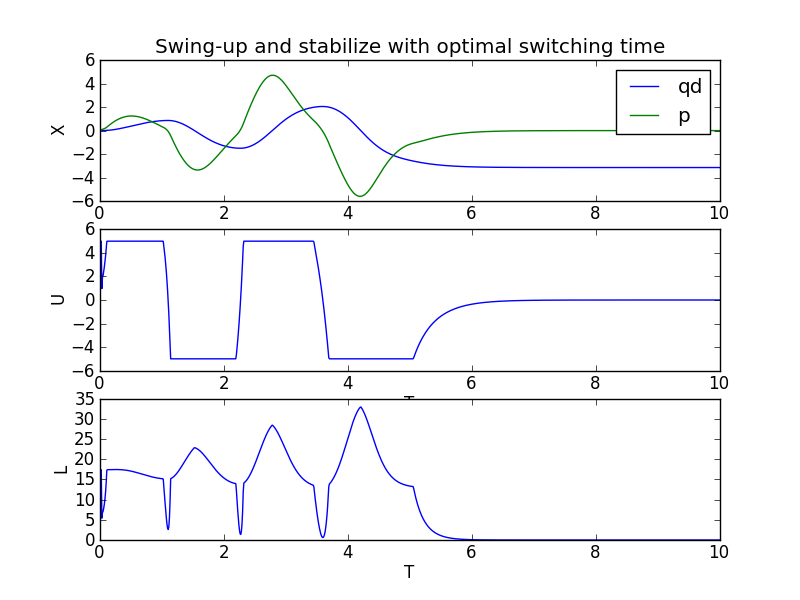
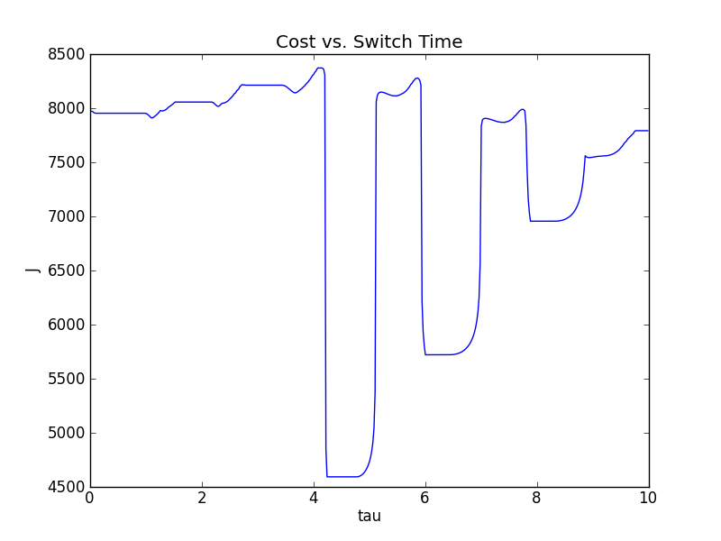

Calculate optimal switching time
================================
Now let us calculate the optimal time to switch between the energy shaping
swing-up controller and the linear feedback stabilizing controller. In order to
determine this time, tools from optimal control are employed; however, the
details of why these tools work is not explained here. The point is to show how
trep facilitates the implementation because it has already precomputed all the
necessary derivatives.

Create pendulum system
----------------------
The code used to create the pendulum system and the controllers is identical to
the previous sections, except a new variable has been added that designates the
switching time. This is initially set to an initial guess equal to one-half the
final time. We will then use this initial guess to find the optimal switching
time. This variable is ``tau`` is highlighted in the code below.

.. literalinclude:: ./code_snippets/optimalSwitchingTime.py
    :start-after: # Import necessary python modules
    :end-before: # Create cost
    :emphasize-lines: 21

Create cost
-----------
In order to perform an optimization anything there must be some sort of cost
functional that is desirable to minimize. Trep has built in objects to deal with
cost functions and that is what is used here.

.. literalinclude:: ./code_snippets/optimalSwitchingTime.py
    :start-after: # Create cost
    :end-before: # Helper functions

The cost object is created with the :mod:`trep.discopt.DCost` method, which
takes in a state trajectory, input trajectory, state weighting matrix, and input
weighting matrix.

In this case we used the same trajectories and weights that were used for the
design of the linear feedback controller that stabilizes the pendulum to the
upright unstable equilibrium.

Below is a list of the properties and methods of the cost class.

    >>> cost.
    cost.Q       cost.R       cost.l_du    cost.l_dx    cost.l_dxdx  cost.m_dx    cost.ud      
    cost.Qf      cost.l       cost.l_dudu  cost.l_dxdu  cost.m       cost.m_dxdx  cost.xd 

Please refer to the :ref:`Discrete Trajectory Cost <trep_dcost>` documentation
to learn more this object.

Angle utility functions
-----------------------
Since we would like the :doc:`stabilizing controller <linearFeedbackController>`
to stabilize to any multiple of :math:`\pi`, two helper functions are used to
wrap the angles to between :math:`0` and :math:`2\pi` and between :math:`-\pi`
and :math:`\pi`.

.. literalinclude:: ./code_snippets/optimalSwitchingTime.py
    :pyobject: wrapTo2Pi

.. literalinclude:: ./code_snippets/optimalSwitchingTime.py
    :pyobject: wrapToPi

Simulate function
-----------------
The simulation of the system is done exactly the same way as in previous
sections, except this time the forward simulation is wrapped into its own
function. This makes running the optimization simpler because the simulate
function can be called with different switching times instead of having to have
multiple copies of the same code.

.. literalinclude:: ./code_snippets/optimalSwitchingTime.py
    :pyobject: simulateForward
    :emphasize-lines: 30,46

The choice of which controller to use within the simulation function is decided
based on if the simulation time is less than the switching time (highlighted
above). If the simulation time is less than ``tau`` then the swing-up controller
is used, otherwise the linear stabilizing controller is used.  Also note that we
store and return a vector of the derivatives of the dynamics with respect to the
state (highlighted above) i.e. :mod:`trep.discopt.DSystem.fdx`.

Optimize
--------
The optimization of the switching time is done in the standard way of using a
gradient decent method to minimize a cost function with respect to the switching
time. Both a descent direction and a step size must be calculated. The negative
gradient of the cost to the switching time is used for the descent
direction. Therefore, the switching time is updated with the following

.. math:: \tau(k+1) = \tau(k) - \gamma*\frac{\partial J}{\partial \tau(k)}

where :math:`\tau` is the switching time, :math:`\gamma` is the step size, and
:math:`J` is the cost function.

To calculate the negative gradient in each iteration of the optimization, first
the system is simulated forward from the initial time to the final time. Then
the costate of the system is simulated backward from the final time to the
switching time. The gradient at the switching time is the inner product of the
difference between the two control laws and the costate.

Trep greatly simplifies this calculation because it has already calculated the
necessary derivatives. In the simulation function the derivative of the system
with respect to :math:`x` (highlighted above) is stored at each time
instance. Also, the derivative of the cost with respect to :math:`x` has been
already calculated with trep. Both of these derivatives are used in the backward
simulation of the costate (highlighted below).

An Armijo line search is used to calculate the step size in each iteration of
the optimization.

.. literalinclude:: ./code_snippets/optimalSwitchingTime.py
    :start-after: # Optimize
    :end-before: # Simulate with optimal switching time
    :emphasize-lines: 15,16

The results of each iteration are then printed to the screen. The optimization
stops when the gradient is smaller than 0.001 or the number iteration is 10 or
more. Once the optimization completes the optimal switching time is printed to
the screen.

Simulate with optimal switching time
------------------------------------
Once the optimal switching time is calculated the system can be simulated
forward from its initial configuration. It will reach its desired configuration
given the constrained input by switching between the two controllers. In
addition, this switch is performed at the optimal time.

.. literalinclude:: ./code_snippets/optimalSwitchingTime.py
    :start-after: # Simulate with optimal switching time
    :end-before: # Visualize the system in action

From the output of the simulation you can see that it take 3 iteration to
converge to the optimal switching time of 4.63.

    >>> %run optimalSwitchingTime.py
    Optimization iteration: 1
    Current switch time: 5.00
    New switch time: 4.79
    Current cost: 9680.81
    Parital of cost to switch time: 1.70
    ---
    Optimization iteration: 2
    Current switch time: 4.79
    New switch time: 4.63
    Current cost: 9214.82
    Parital of cost to switch time: 0.62
    ---
    Optimization iteration: 3
    Current switch time: 4.63
    New switch time: 4.63
    Current cost: 9204.84
    Parital of cost to switch time: 0.00
    ---
    Optimal switch time: 4.63 

Visualize the system in action
------------------------------
The visualization is created just as in previous sections.

.. literalinclude:: ./code_snippets/optimalSwitchingTime.py
    :start-after: # Visualize the system in action

Let's also plot the state, input, and cost verse time.

Just for reference the cost verse switching time is shown for all switching
times from time zero to the final time. You can see that the optimization does
find a switching time with a local minimum in the cost. Clearly, this cost verse
switching time is non-convex, thus our gradient descent method only finds a
local minimizer, and not a global minimizer.

optimalSwitchingTime.py code
----------------------------
Below is the entire script used in this section of the tutorial.

.. literalinclude:: ./code_snippets/optimalSwitchingTime.py
    :linenos:
